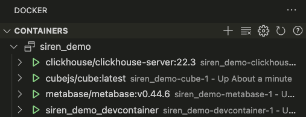
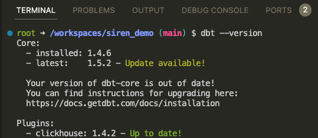
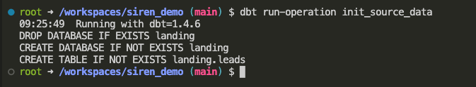
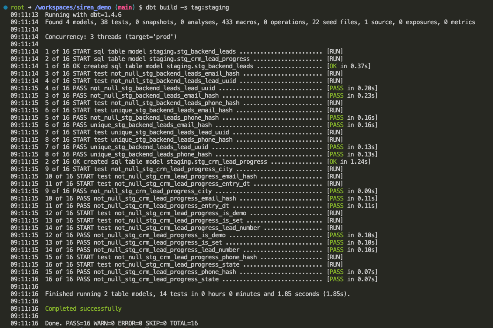
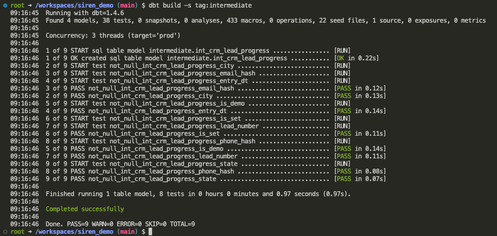
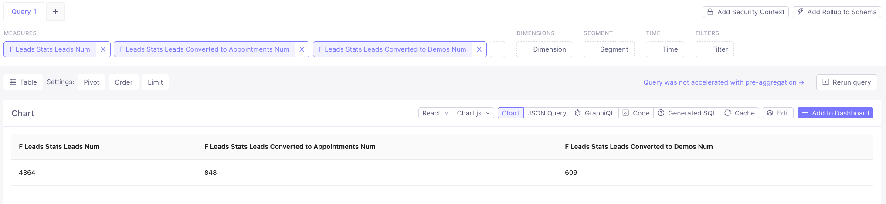
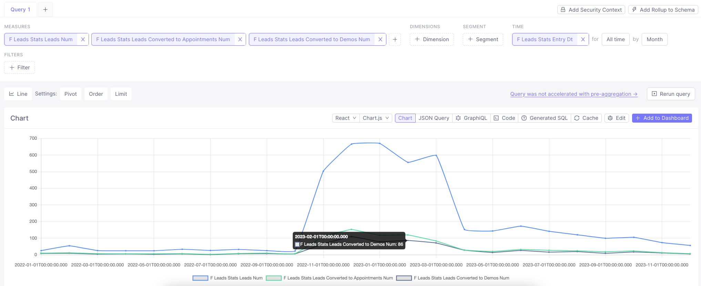

# Siren demo

- Clickhouse (Database)
- dbt (Transformations)
- Cube (Metrics) + Metabase (Business Intelligence)

## Table of Contents

1. [Configure environment](#configure-environment)
1. [Install dbt packages](#install-dbt-packages)
1. [Configure data sources](#configure-data-sources)
1. [Build staging layer models](#build-staging-layer-models)
1. [Build intermediate layer models](#build-intermediate-layer-models)
1. [Build a data mart](#build-a-data-mart)
1. [Set up metrics layer with Cube](#set-up-metrics-layer-with-cube)
1. [Visualize metrics](#visualize-metrics)

## Configure environment

1. Install prerequisites:
    - IDE (e.g. [VS Code](https://code.visualstudio.com/docs/setup/setup-overview))
    - [Docker](https://docs.docker.com/engine/install/)

1. Fork & Clone this repository and open in IDE

1. Initialize ENV variables with `.env` file

    `.env` is used to store secrets as environment variables.

    Copy template file [.env.template](./.env.template) to `.env` file:
    
    ```bash
    cp .env.template .env
    ```

    Open file in editor and set your own values.

    > ❗️ Never commit secrets to git    

1. Spin up Docker containers

    All the services are configured via [Docker containers](./docker-compose.yml).

    - devcontainer
    - Clickhouse
    - Metabase
    - Cube

    ```bash
    # build dev container
    devcontainer build .

    # open dev container
    devcontainer open .
    ```

    

1. Verify you are in a development container by running commands:

    ```bash
    dbt --version
    ```

    

    If any of these commands fails printing out used software version then you are probably running it on your local machine not in a dev container!


## Install dbt packages

1. Install modules via [packages.yml](./packages.yml)

    ```bash
    dbt clean # clean temp files
    dbt deps # install dependencies (modules)
    ```

    We will use [dbt-labs/dbt_utils](https://github.com/dbt-labs/dbt-utils) package for this project.

1. Turn on custom schema management
    
    I use [generate_schema_name.sql](./macros/generate_schema_name.sql) macro to set target schema names:

    > Renders a schema name given a custom schema name. In production, this macro
    > will render out the overriden schema name for a model. Otherwise, the default
    > schema specified in the active target is used.

    Take a look at [custom_schema_management.sql](https://github.com/kzzzr/mybi-dbt-core/blob/main/macros/custom_schema_management.sql) macro to find out more.
    
## Configure data sources

1. [Create](./macros/init_source_data.sql) table from Parquet file with source data:
    
    ```bash
    dbt run-operation init_source_data
    ```

    

2. Seed .csv files with data (CRM snapshots):

    ```bash
    dbt seed
    ```

## Build DWH

DWH is structured like this for simplicity:

```yml
  siren_demo:
    staging:
      +schema: staging
      +tags: ['staging']
    intermediate:
      +schema: intermediate
      +tags: ['intermediate']
    marts:
      +schema: analytics
      +tags: ['analytics']
```

### Build staging layer models

- Ensure data quality with expectations testing with [staging.yml](./models/staging/staging.yml)
- Generate surrogate keys `{{ dbt_utils.generate_surrogate_key(['phone_hash', 'email_hash']) }} as lead_hash`
- Union all .csv data with `dbt_utils.union_relations()`
- Remove header rows `ENTRYDATE not in ('-----')`
- Parse timestamps `parseDateTimeBestEffortOrNull(ENTRYDATE) AS entry_dt`
- Coalesce data `COALESCE(CITY, CityName, trim(splitByChar('|', assumeNotNull(location))[1]))`

```bash
dbt build -s tag:staging
```



### Build intermediate layer models

- Set Clickhouse table engine to `ReplacingMergeTree()`
- Force deduplicate rows with post-hook `post_hook=['OPTIMIZE TABLE {{ this }} FINAL DEDUPLICATE BY lead_hash, entry_dt, appt_dt']`
- Ensure data quality with expectations testing with [intermediate.yml](./models/intermediate/intermediate.yml)

```bash
dbt build -s tag:intermediate
```



## Build a data mart

- Join data from backend and customer CRM
- Ensure data quality with expectations testing with [marts.yml](./models/marts/marts.yml)

```bash
dbt build -s tag:analytics
```


## Set up metrics layer with Cube

- Define dbt Metrics in [f_leads_stats.yml](./schema/f_leads_stats.yml)

## Visualize metrics

Now we are ready to visualize key metrics on a dashboard.

- Access dbt Metrics through [Cube playground](http://localhost:4000/#/build?query={%22measures%22:[%22f_leads_stats.leads_num%22,%22f_leads_stats.leads_converted_to_appointments_num%22,%22f_leads_stats.leads_converted_to_demos_num%22]}) or [Metabase](http://localhost:3000)



